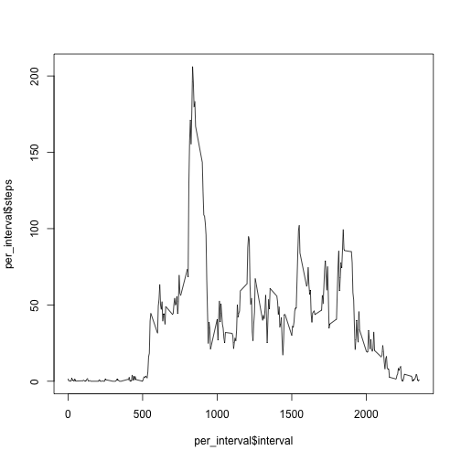
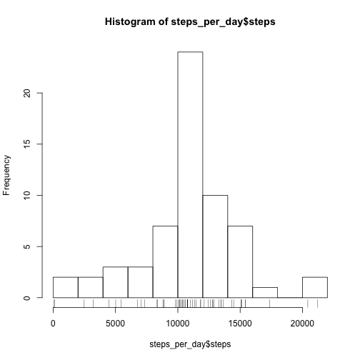

## Loading libraries


```r
library(dplyr)
library(data.table)
library(ggplot2)
```

## Loading and preprocessing the data


```r
data <- read.csv("./data/activity.csv", header = TRUE, sep = ",")
data$date <- as.Date(data$date)
data <- tbl_df(data)
```

## What is mean total number of steps taken per day?

We now compute the number of steps by day, using the 'summarise()' function.

```r
daily <- group_by(data, date)
(per_day   <- summarise(daily, steps = sum(steps,na.rm = TRUE)))
```

```
## Source: local data frame [61 x 2]
## 
##          date steps
##        (date) (int)
## 1  2012-10-01     0
## 2  2012-10-02   126
## 3  2012-10-03 11352
## 4  2012-10-04 12116
## 5  2012-10-05 13294
## 6  2012-10-06 15420
## 7  2012-10-07 11015
## 8  2012-10-08     0
## 9  2012-10-09 12811
## 10 2012-10-10  9900
## ..        ...   ...
```


```r
hist(per_day$steps, breaks = 15)
rug(per_day$steps)
```

 


```r
mean(per_day$steps, na.rm = TRUE)
```

```
## [1] 9354.23
```

```r
median(per_day$steps, na.rm = TRUE)
```

```
## [1] 10395
```

## What is the average daily activity pattern?

We first need to compute average over 5-minute interval.

```r
inter <- group_by(data, interval)
(per_interval <- summarise(inter, steps = mean(steps,na.rm = TRUE)))
```

```
## Source: local data frame [288 x 2]
## 
##    interval     steps
##       (int)     (dbl)
## 1         0 1.7169811
## 2         5 0.3396226
## 3        10 0.1320755
## 4        15 0.1509434
## 5        20 0.0754717
## 6        25 2.0943396
## 7        30 0.5283019
## 8        35 0.8679245
## 9        40 0.0000000
## 10       45 1.4716981
## ..      ...       ...
```

```r
plot(per_interval$interval,per_interval$steps, type = "l")
```

 

```r
nb.step.max=max(per_interval$steps,na.rm=TRUE)
filter(per_interval,steps==nb.step.max)$interval
```

```
## [1] 835
```

Seems to be the 835 interval.

## Imputing missing values


```r
dim(filter(data,is.na(steps)))
```

```
## [1] 2304    3
```

Then, we find 2,304 NA values.

To fill the NA, we'll use the average value for the correpsonding 5-minute interval. We use the merge function for this purpose.


```r
m <- merge(data,per_interval,by="interval")
m2 <- mutate(m,steps=steps.x)
m2 <- tbl_df(m2)
m2$steps[is.na(m2$steps.x)] <- m2$steps.y[is.na(m2$steps.x)]
newdata <- arrange(select(m2,steps,date,interval),date)
```

The dataset 'newdata' is then equal to the original dataset but with the missing data filled in.


```r
by_day <- group_by(newdata, date)
steps_per_day <- summarise(by_day,steps = sum(steps))
```


```r
hist(steps_per_day$steps, breaks = 15)
rug(steps_per_day$steps)
```

 


```r
mean(steps_per_day$steps)
```

```
## [1] 10766.19
```

```r
median(steps_per_day$steps)
```

```
## [1] 10766.19
```

The cleaning operation has an impact on the mean and median of the new distribution.

## Are there differences in activity patterns between weekdays and weekends?

Let's identify the weekdays.


```r
Sys.setlocale("LC_TIME", "en_US.UTF-8")
```

```
## [1] "en_US.UTF-8"
```

```r
kub <- mutate(newdata,day=weekdays(date))
kub$day[kub$day=="Saturday" | kub$day=="Sunday"] <- "weekend" 
kub$day[kub$day!="weekend"] <- "weekday" 
kub$day <- factor(kub$day)
table(kub$day)
```

```
## 
## weekday weekend 
##   12960    4608
```

We then compute average for weekdays and weekends.

```r
step_weekdays <- summarise(group_by(filter(kub,day=="weekday"),interval), steps = mean(steps))
step_weekends <- summarise(group_by(filter(kub,day=="weekend"),interval), steps = mean(steps))
```
Now the plots :

```r
par(mfrow=c(2,1))
plot(step_weekdays, type = "l", main = "Weekdays", col="blue")
plot(step_weekends,type = "l", main = "Weekends", col="red")
```

 
